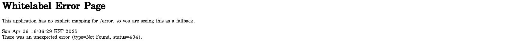

웹 : 여러 컴퓨터가 서로 연결되어 정보를 공유하는 공간
    -> 클라이언트 : 데이터의 생성/조회/수정/삭제 요청을 전송
    -> 서버 : 요청대로 동작을 수행하고 응답을 전송
        클라이언트-서버의 관계는 상대적이다!
 

프로토콜과 HTTP
    컴퓨터는 정해진 동작만 수행하므로 데이터 전송 방법을 명시해줘야한다.
        -> 정해진 규칙이 필요하다.
        -> 프로토콜 : 네트워크 안에서 요청과 응답을 보내는 규칙
        -> 웹에서는 "HTTP"라는 프로토콜을 사용한다.
    
    HTTP Method : 데이터를 다루는 방법
    URL(Uniform Resource Location) : 다룰 데이터의 위치

    자주 사용하는 HTTP Method
    1. GET : 데이터를 가져온다(조회)    
    2. POST : 데이터를 게시한다(생성) -> 데이터를 중복적으로 생성 가능
    3. PUT : 데이터를 교체한다(수정) -> 데이터가 없으면 생성, 있으면 전체를 교체
    4. PATCH : 데이터를 수정한다(수정) -> 데이터의 일부분을 수정
    5. DELETE : 데이터를 삭제한다(삭제)

    URL 구조
        프로로콜(scheme) :// 서버 주소(domain) / 서버 내 데이터 위치(path) ? Query String

    HTTP 데이터 = HTTP 헤더(통신에 대한 정보) + HTTP 바디(주고 받으려는 데이터)
        -> HTTP 바디는 생략이 가능하다

    상태 코드 : 요청에 대한 처리 결과를 나타내는 코드
        1. 200 : 처리 성공(ok)
        2. 201 : 데이터 생성 성공(created)
        3. 400 : 클라이언트 요청 오류(bad request)
        4. 404 : 요청 데이터 없음(not found)
        5. 500 : 서버 에러(internal server error)

API(Application Programming Interface) : 어플리케이션에서 원하는 기능을 수행하기 위해 어플리케이션과 소통하는 방법(창구)을 정의하는 것
    -> 프론트가 백엔드에 요청을 보낼 때 어떤 http method, url을 사용해야 하는지 정의하고 각 요청에 대해 어떤 응답을 보내는지 정의하는 것

    REST API : REST 아키텍처를 따르도록 설계한 API
        URL : 조작할 데이터 (명사)
        HTTP method : 데이터에 대한 행위 (동사)
        https://velog.io/@somday/RESTful-API-%EC%9D%B4%EB%9E%80

Todo mate API 설계

회원가입 : POST/auth/register
로그인 : GET/auth/login
나의 할 일 생성 : POST/todo
나의 할 일 조회 : GET/todo
나의 할 일 수정 : PATCH/todo/:id
나의 할 일 삭제 : DELETE/todo/:id
나의 할 일 체크 : POST/todo/:id/check
나의 할 일 체크해제 : POST/todo/:id/uncheck
친구 찾기 : GET/users/search?username={username}
팔로우 : POST/friends/:userId/follow
언팔로우 : POST/friends/:userId/unfollow
나의 친구 리스트 조회 : GET/friends
특정 친구의 할 일 조회: GET/friends/:userId/todo

